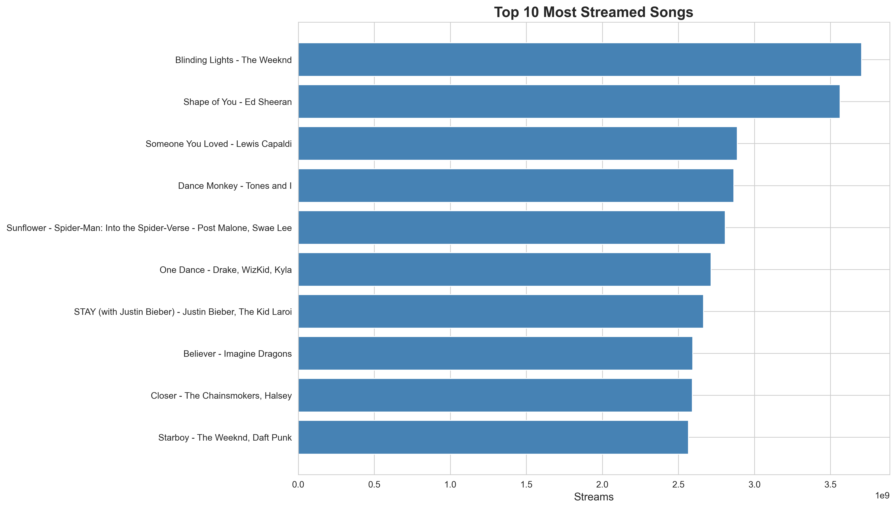
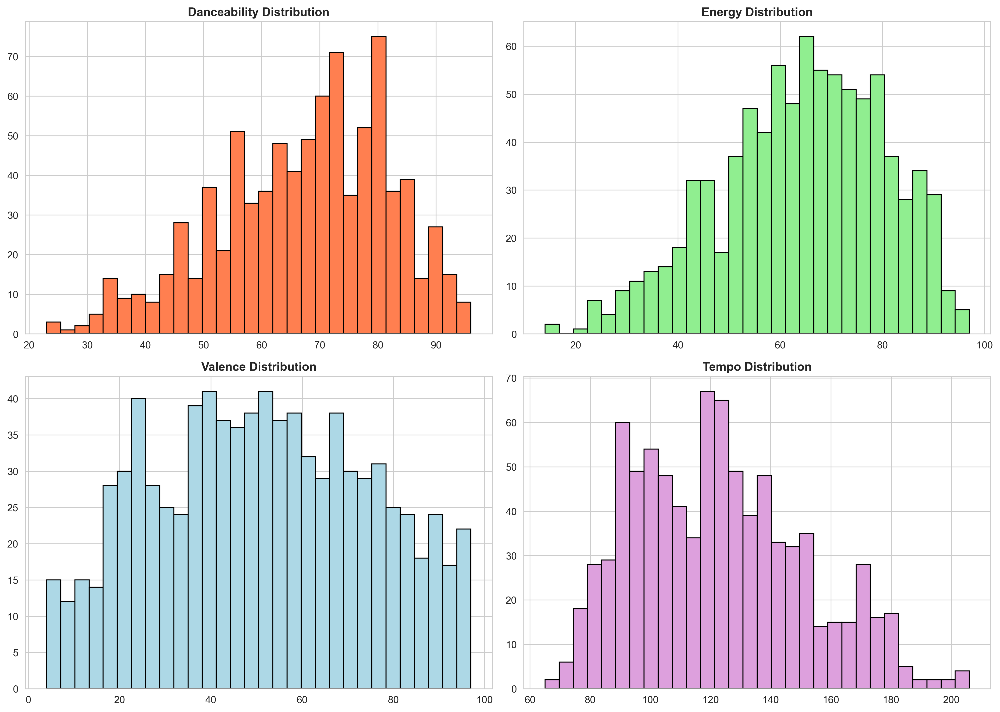
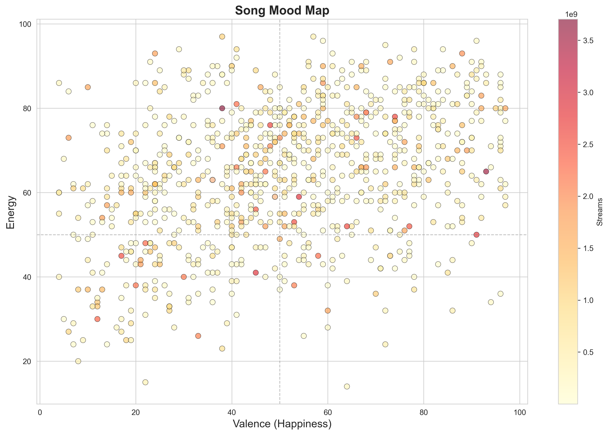
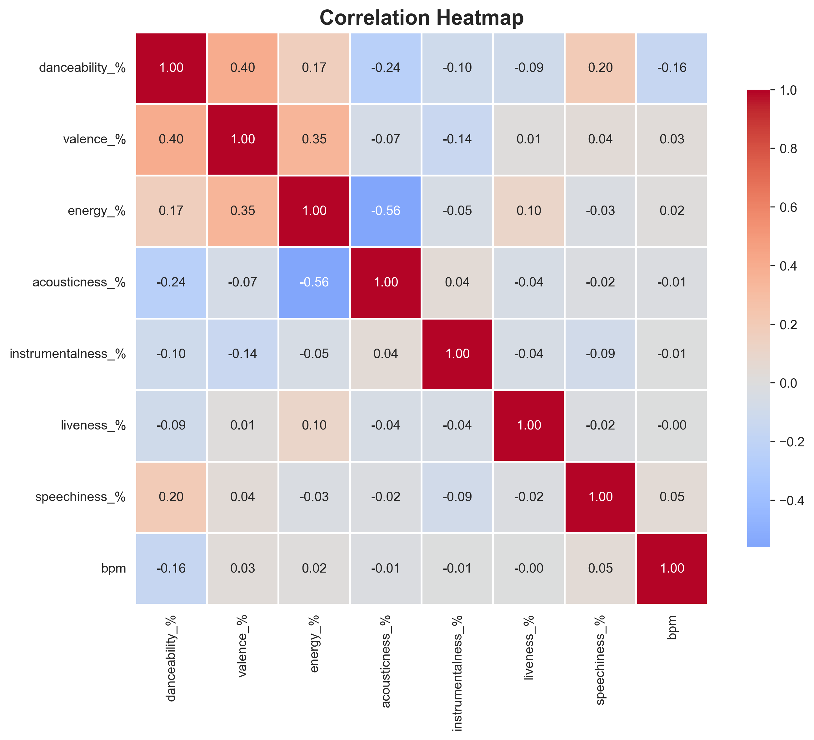

# Spotify Music Analysis

Analyzing what makes songs popular on Spotify using data from the most streamed songs of 2023.

## About This Project

I wanted to understand what audio characteristics make songs successful on Spotify. Using a dataset of 857 popular songs, I explored patterns in features like danceability, energy, and mood to see what trends emerge in today's music.

## What I Found

After analyzing the data, a few interesting patterns stood out:

**Popular songs share some common traits:**
- Most have moderate to high danceability (around 60-80%)
- There's a clear clustering of "happy and energetic" songs in the mood map
- Energy and loudness are strongly connected
- Tempo varies widely - there's no single "winning" BPM

**The mood map was particularly interesting:** Songs tend to cluster in the "happy/energetic" quadrant, but there's still plenty of variety across all mood types.

## Visualizations

### Top 10 Most Streamed Songs

### How Audio Features Are Distributed

### Mood Map: Energy vs Happiness

### Feature Correlations

## Tools I Used

- Python for all analysis
- pandas for data cleaning and manipulation
- matplotlib and seaborn for visualizations
- Jupyter Notebook for exploratory analysis

## The Data

I used the "Most Streamed Spotify Songs 2023" dataset from Kaggle, which includes audio features for 953 songs. After cleaning (removing missing values), I worked with 857 tracks.

Key features analyzed:
- Danceability, Energy, Valence (happiness)
- Acousticness, Tempo (BPM), Streams
- Release information

## What I Learned

This was my first data science project, and I learned:
- How to clean and prepare real-world data
- Creating meaningful visualizations
- Finding patterns in data
- The importance of good documentation

## What's Next

Some ideas I'd like to explore:
- Build a model to predict if a song will be popular
- Analyze how music has changed over time
- Look at differences between genres
- Create an interactive dashboard

## Running This Yourself

If you want to run this analysis:

1. Clone this repo
2. Install requirements: `pip install pandas numpy matplotlib seaborn jupyter`
3. Open the Jupyter notebook in the `notebooks` folder
4. Run the cells to see the analysis

## Dataset Source

Dataset from Kaggle: [Most Streamed Spotify Songs 2023](https://www.kaggle.com/datasets/nelgiriyewithana/top-spotify-songs-2023)

---

Feel free to reach out if you have questions or suggestions!